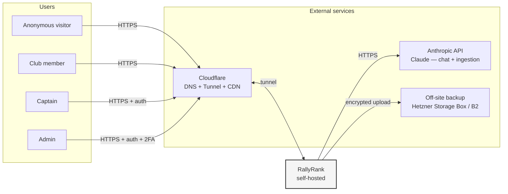
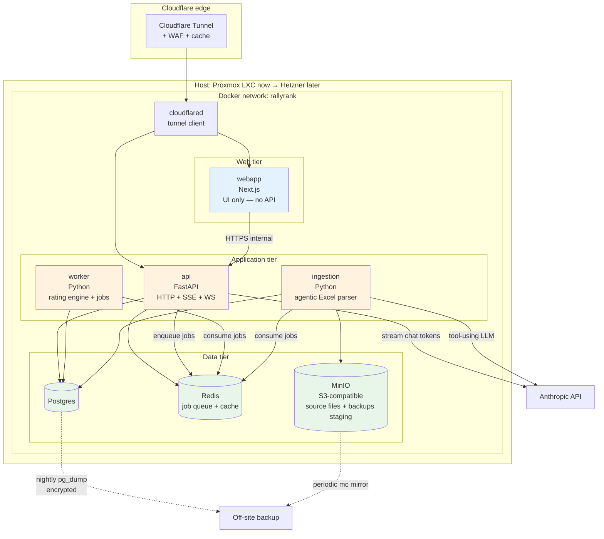
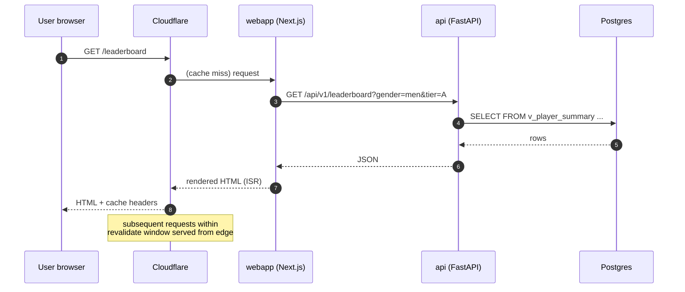
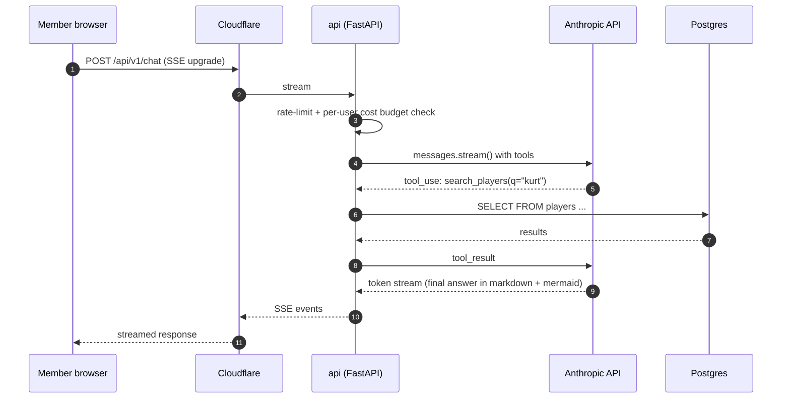
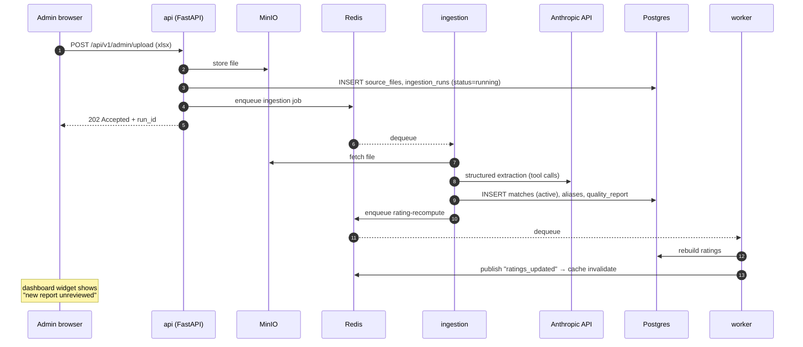
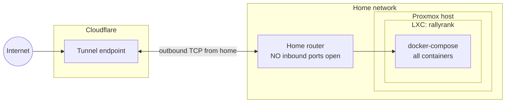
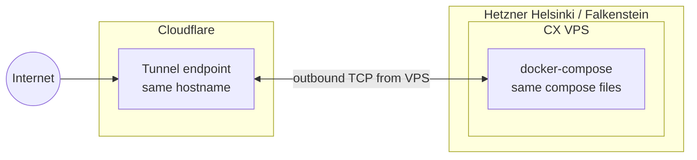

# Architecture

Status: **proposed** — supersedes the diagram in PLAN.md §4 once ADR-007
is accepted.

This document is the visual + textual reference for how RallyRank's
components fit together. It is updated when an accepted ADR changes a
component, boundary, or data flow. Keep it terse — detail belongs in the
ADR that introduced it.

## C4 — Context (what's at the boundary)



**Trust boundary:** the only ingress to the system is via Cloudflare
Tunnel. The home/Hetzner host has no inbound ports open to the public
internet. See ADR-014.

## C4 — Containers (what runs where)



**Why this shape (versus PLAN.md §4):**

- API is now a separate service, not Next.js routes. See ADR-007.
- Webapp's only outbound dependency is the API — no direct DB/Redis access.
  This is what makes a future native client a config-only addition.
- Worker and ingestion are separate processes (not threads in the API)
  so a long-running rating recompute or a slow Excel parse never blocks
  HTTP responses.

## Data flow — the four canonical paths

### Path 1: Anonymous user views a leaderboard



### Path 2: Member chats with the bot



### Path 3: Admin uploads a tournament file



### Path 4: Re-process a previous ingestion (idempotent supersede)

```mermaid
sequenceDiagram
    autonumber
    participant Adm as Admin
    participant A as api
    participant R as Redis
    participant I as ingestion
    participant PG as Postgres
    participant W as worker

    Adm->>A: POST /api/v1/admin/runs/:id/reprocess
    A->>PG: INSERT new ingestion_runs row<br/>(supersedes_run_id = :id)
    A->>R: enqueue
    R-->>I: dequeue
    I->>PG: insert new matches with new run_id<br/>UPDATE old matches SET superseded_by_run_id = new
    I->>R: enqueue full rating recompute
    R-->>W: dequeue
    W->>PG: TRUNCATE rating_history; recompute from active matches
    W->>R: publish invalidate
```

Per PLAN.md §5.3.1 — re-processing is idempotent because all reads filter
`WHERE superseded_by_run_id IS NULL`.

## Deployment topology

### Today (Proxmox at home)



### Future (Hetzner CX series)



**Migration is config-only:** stop the Proxmox tunnel client, start a new
one on Hetzner with the same tunnel ID. DNS does not change. Public
hostname does not change. See ADR-014.

## Component responsibilities

| Component | Owns | Talks to | Doesn't talk to |
|---|---|---|---|
| `cloudflared` | tunnel ingress, edge cache compatibility | Cloudflare edge, webapp:3000, api:8000 | Postgres, Redis, MinIO |
| `webapp` (Next.js) | rendering, page routing, ISR cache | api (HTTPS) | Postgres, Redis, MinIO directly |
| `api` (FastAPI) | HTTP/SSE/WS surface, auth, request validation, chat orchestration | Postgres (read mostly), Redis (enqueue + cache), Anthropic API | MinIO directly (delegates to ingestion), spreadsheets |
| `worker` (Python) | rating engine, scheduled recompute, cache invalidation | Postgres (read+write rating tables), Redis (consume) | HTTP clients, MinIO |
| `ingestion` (Python) | spreadsheet parsing, agentic extraction, quality reports | Postgres (write matches), MinIO (read/write files), Redis (consume), Anthropic API | rating math (enqueues a job for worker) |
| `Postgres` | source of truth for all relational data | nothing — clients connect to it | nothing outbound |
| `Redis` | job queue, ephemeral cache, pub/sub for invalidation | nothing — clients connect to it | nothing outbound |
| `MinIO` | source spreadsheet storage, backup staging | nothing — clients connect to it | nothing outbound |

## Open architecture questions (tracked as ADRs)

| Question | ADR | Status |
|---|---|---|
| API as service (not Next.js routes) | ADR-007 | proposed |
| API language | ADR-008 | proposed (FastAPI) |
| Auth strategy (JWT vs session) | ADR-009 | not yet drafted |
| Realtime (SSE vs WS per use case) | ADR-010 | not yet drafted |
| GraphQL deferred | ADR-011 | not yet drafted |
| Contract source-of-truth | ADR-012 | not yet drafted |
| Monorepo tooling | ADR-013 | not yet drafted |
| Hosting + ingress | ADR-014 | proposed (CF Tunnel) |
| Backup + DR | ADR-015 | not yet drafted |
| Quality bar definition | ADR-016 | not yet drafted |

See `adr/INDEX.md` for the full roster.
