# Diagrams — visual atlas

Purpose: a single visual reference for the whole system. Read non-linearly
— jump to whichever diagram you need.

This file complements `architecture.md` (which carries the ADR-scoped
container + deployment diagrams). Anything *system-shaped* lives here:
domain model, user journeys, lifecycles, security zones, failure modes,
chatbot internals, and the future native-app slot.

Each diagram is tagged with one of three confidence levels:

- **locked** — based on accepted ADR or schema already in `scripts/phase0/schema.sql`
- **proposed** — based on proposed (not yet accepted) ADR; will firm up when accepted
- **tentative** — depends on a not-yet-drafted ADR (typically ADR-002 visibility, ADR-009 auth, ADR-021 caching); shown as best-current-thinking, expected to change

## Table of contents

1. [Domain model (ERD)](#1-domain-model-erd) — locked
2. [Ingestion run lifecycle](#2-ingestion-run-lifecycle) — locked
3. [Player lifecycle (with merges)](#3-player-lifecycle-with-merges) — locked
4. [Match → rating flow](#4-match--rating-flow) — locked
5. [User personas + permissions sketch](#5-user-personas--permissions-sketch) — tentative
6. [Webapp route map](#6-webapp-route-map) — tentative
7. [API resource map](#7-api-resource-map) — tentative
8. [Chatbot conversation internals](#8-chatbot-conversation-internals) — proposed
9. [Ingestion pipeline (Phase 3)](#9-ingestion-pipeline-phase-3) — proposed
10. [Auth + token flow](#10-auth--token-flow) — tentative
11. [Trust zones + security boundaries](#11-trust-zones--security-boundaries) — locked
12. [Cache + invalidation flow](#12-cache--invalidation-flow) — tentative
13. [Failure-mode handling](#13-failure-mode-handling) — proposed
14. [Native app slot (future)](#14-native-app-slot-future) — proposed

---

## 1. Domain model (ERD)

**Status: locked** — taken from `scripts/phase0/schema.sql`, with the
Phase 1+ tables called out separately.

```mermaid
erDiagram
    CLUBS ||--o{ PLAYERS_M : has
    CLUBS ||--o{ TOURNAMENTS : hosts
    CLUBS ||--o{ SOURCE_FILES : owns

    PLAYERS ||--o{ PLAYER_ALIASES : "known as"
    PLAYERS ||--o{ MATCH_SIDES : "plays in"
    PLAYERS ||--o{ RATINGS : has
    PLAYERS ||--o{ RATING_HISTORY : "history of"
    PLAYERS ||--o{ PLAYER_TEAM_ASSIGNMENTS : "assigned by captain"
    PLAYERS ||--o| PLAYERS : "merged into"

    SOURCE_FILES ||--|{ INGESTION_RUNS : "processed by"
    INGESTION_RUNS ||--o{ MATCHES : produces
    INGESTION_RUNS ||--o| INGESTION_RUNS : supersedes

    TOURNAMENTS ||--|{ MATCHES : contains
    TOURNAMENTS ||--o{ PLAYER_TEAM_ASSIGNMENTS : "team rosters"

    MATCHES ||--|{ MATCH_SIDES : "side A and B"
    MATCHES ||--o{ MATCH_SET_SCORES : "set-by-set"
    MATCHES ||--o{ RATING_HISTORY : "rating Δ from"

    PLAYERS {
        int id PK
        string canonical_name UK
        string gender
        int dob_year
        int merged_into_id FK
    }

    MATCHES {
        int id PK
        int tournament_id FK
        date played_on
        string match_type
        string division
        int ingestion_run_id FK
        int superseded_by_run_id FK
        bool informal
        bool walkover
    }

    MATCH_SIDES {
        int match_id PK,FK
        string side PK
        int player1_id FK
        int player2_id FK
        int sets_won
        int games_won
        bool won
    }

    RATINGS {
        int player_id PK,FK
        string model_name PK
        float mu
        float sigma
        int n_matches
    }

    PLAYERS_M {
        note "(many-to-many in Phase 5: player_club_memberships table)"
    }
```

**Reading the diagram:**

- `PLAYERS ||--o| PLAYERS` (self-reference) is the merge link — when two
  records are deduped, one keeps `merged_into_id = NULL`, the other points
  to it.
- `INGESTION_RUNS ||--o| INGESTION_RUNS` is the supersede link — re-processing
  a file creates a new run that supersedes the previous one (PLAN.md §5.3.1).
- The `RATINGS` PK is `(player_id, model_name)` — the model-agnostic
  design from PLAN.md §5.7. Every rating-aware query *must* specify a model.
- Tables not yet present (Phase 1+): `users`, `user_club_roles`,
  `model_predictions`, `model_scoreboard`, `champion_history`, `pair_chemistry`,
  `model_feedback`, `player_club_memberships`. Documented in `schema.sql`.

---

## 2. Ingestion run lifecycle

**Status: locked** — defined in PLAN.md §5.3.1 and `schema.sql`.

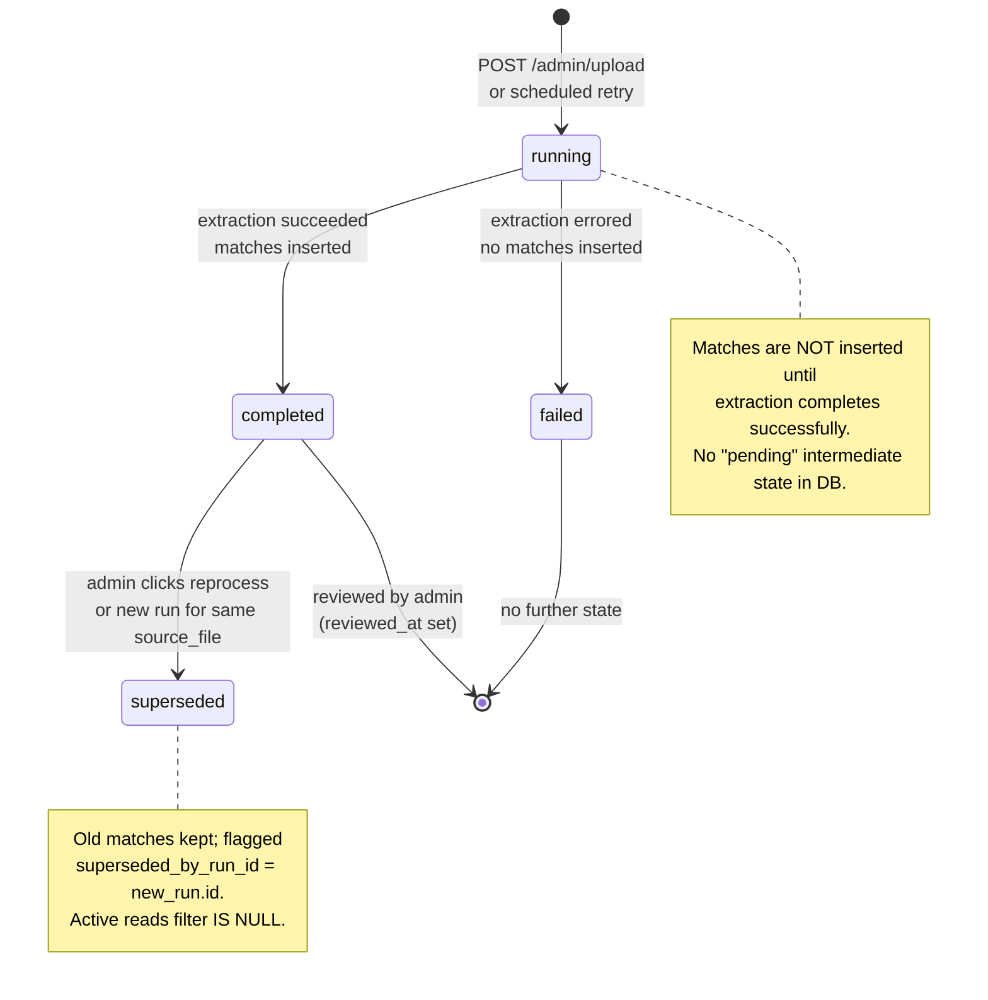

**Why this matters:**

- "Reviewed" is a flag, not a state — admin review is post-hoc per
  PLAN.md §5.3.1.
- Re-processing is *idempotent* by design — every read query filters
  `WHERE superseded_by_run_id IS NULL`, so old runs become invisible
  without being deleted.
- `failed` is terminal — failed runs do not leave partial data behind.

---

## 3. Player lifecycle (with merges)

**Status: locked** — schema-driven. Merge flow specified in PLAN.md §5.4.

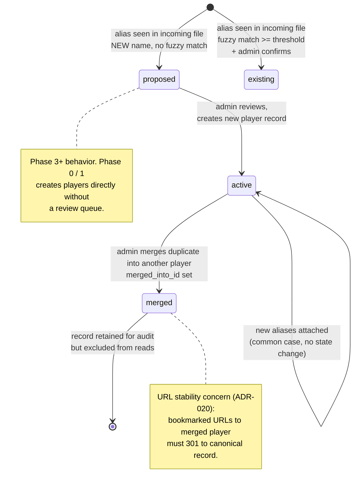

---

## 4. Match → rating flow

**Status: locked** — implemented in `scripts/phase0/rating.py`.

How a single match's outcome propagates into rating updates:

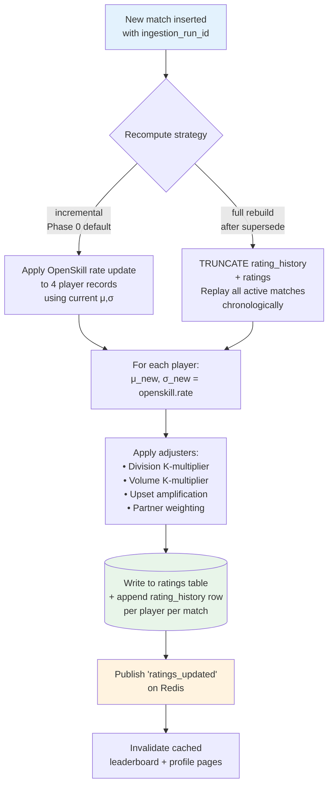

**Notes on the math** (full detail in `rating.py`):

- Phase 0 uses incremental updates for new matches; full rebuilds happen
  on supersede or model parameter changes.
- "Adjusters" are post-OpenSkill multipliers that encode domain
  knowledge (a 6-0 win in Div 4 should not move ratings the same as
  a 6-0 win in Div 1).
- The model-agnostic design means `compute()` can dispatch to multiple
  rating models in one pass (PLAN.md §5.7 champion/challenger).

---

## 5. User personas + permissions sketch

**Status: tentative** — depends on ADR-002 (consent) and ADR-003
(visibility matrix). Diagram shows current best-thinking; will be made
authoritative once those ADRs are accepted.

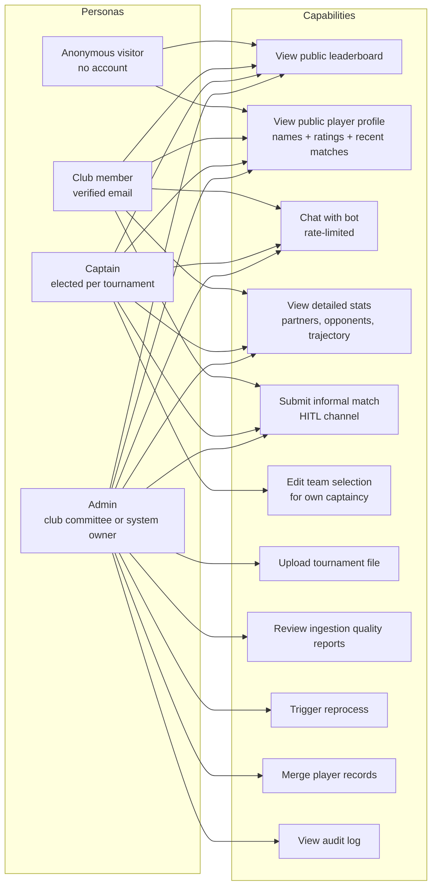

**Open questions** (to be resolved in ADR-002 / ADR-003):

- Are `C1` and `C2` *truly* anonymous, or behind a soft-gate (one-time
  email verification)?
- Does `C2` show full names or initials by default? Per-player override
  via ADR-004?
- Is `C3` member-only (recommended for cost control) or anonymous with
  hard rate-limit?

---

## 6. Webapp route map

**Status: tentative** — page list inferred from PLAN.md §1 and
the report types you described in our first conversation. Final shape
depends on ADR-003 (visibility) and ADR-020 (URL strategy).

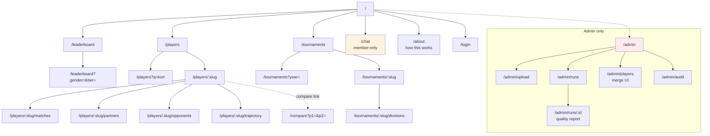

**Convention:** all `/admin/*` routes require role `admin` and are
behind an additional CF Access gate (per ADR-014's "future hardening").

---

## 7. API resource map

**Status: tentative** — locked by ADR-012 (OpenAPI codegen) once the
spec is drafted. Resource shape derives from the report types we
discussed (lists, profiles, comparison, chat).

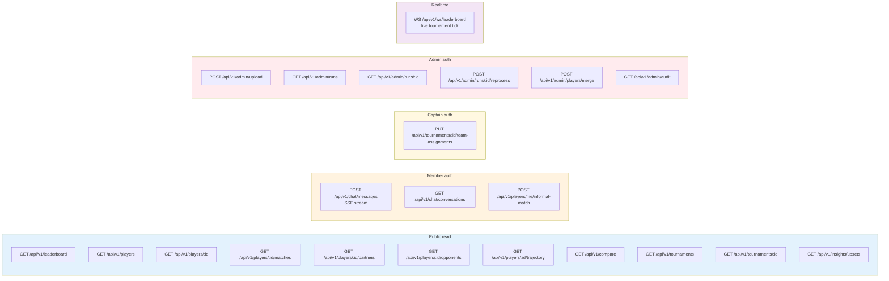

**Versioning:** `/api/v1/` from day 1 per ADR-017 (when drafted). Breaking
changes ship at `/api/v2/` with documented deprecation window for v1.

---

## 8. Chatbot conversation internals

**Status: proposed** — based on the LLM strategy in `research/2026-04-26-llm-options.md`.

End-to-end flow for a single user query that requires a tool call:

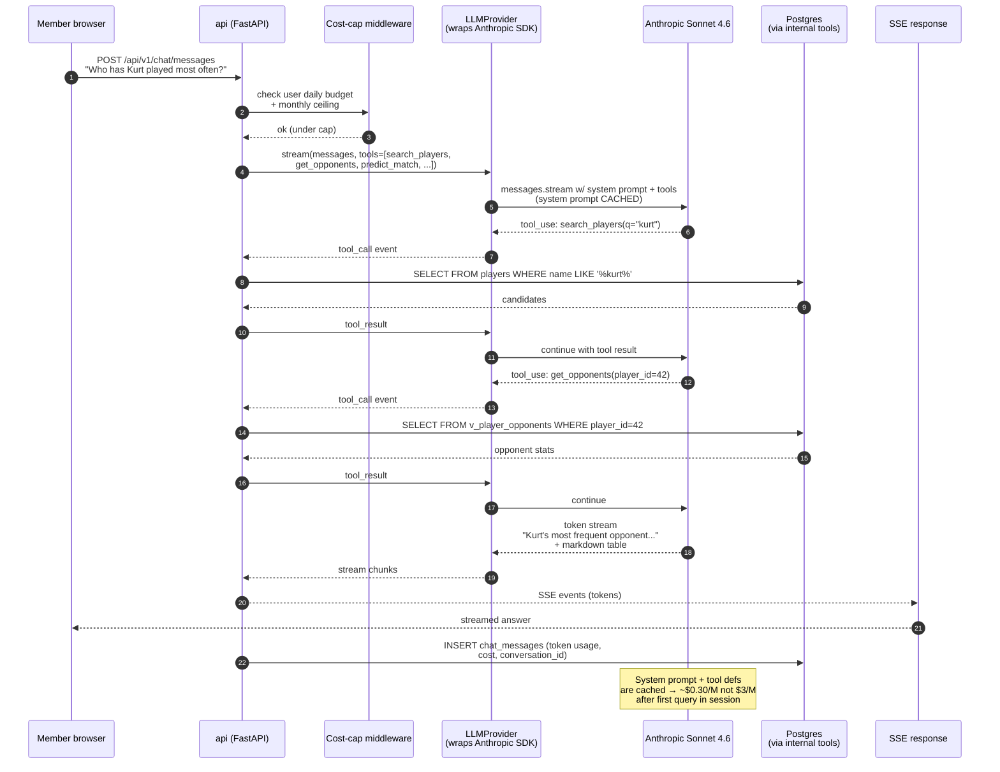

**Key design points:**

- All tool functions are *internal* — they run inside the API process
  using direct Python calls, no extra HTTP hops (the win for ADR-008
  Python choice).
- Cost-cap check happens *before* the LLM call, not after — prevents
  runaway budget overruns.
- Token usage logged per message for per-user budget tracking and
  monthly cost forecasting.
- System prompt + tool definitions are written *once* and cached for
  the session — see `research/2026-04-26-llm-options.md` for the 4–5×
  cost impact this has.

---

## 9. Ingestion pipeline (Phase 3)

**Status: proposed** — extends the simpler sequence in `architecture.md`.
Locked by PLAN.md §5.3 + §5.3.1; details refined here.

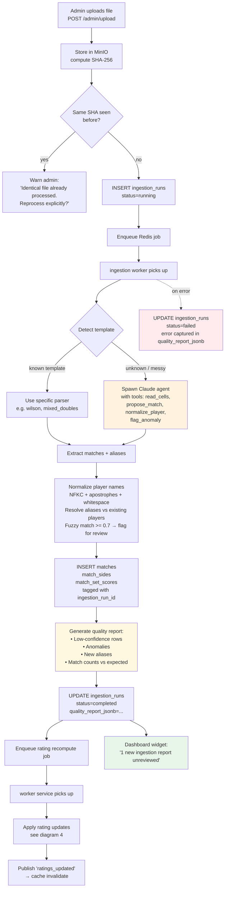

**Notes:**

- Template detection is the optimization that lets cheap parsers handle
  the easy 80% of files; agentic extraction handles the messy 20% (per
  PLAN.md §5.3 hybrid approach).
- The agent has a small, allowlisted toolset — it can *read* cells and
  *propose* matches but cannot directly write to the DB; the orchestrating
  worker validates and writes.
- Quality report is *always* generated, even on success — not just on
  error. This is the surface the admin reviews.

---

## 10. Auth + token flow

**Status: tentative** — depends on ADR-009 (auth strategy). Diagram shows
expected JWT-bearer flow with refresh tokens, web + future native parity.

```mermaid
sequenceDiagram
    autonumber
    participant U as Browser / Native client
    participant API as api (FastAPI)
    participant DB as Postgres
    participant EMAIL as Email provider

    note over U,EMAIL: Magic-link login (passwordless)

    U->>API: POST /api/v1/auth/login<br/>{email}
    API->>DB: lookup or create user
    API->>EMAIL: send magic-link with one-time token
    EMAIL-->>U: email with link

    U->>API: GET /api/v1/auth/verify?token=...
    API->>DB: validate one-time token<br/>(single-use, 15min TTL)
    API-->>U: 200 + access JWT (1h) + refresh JWT (30d)<br/>(web: HttpOnly cookie + JSON; native: JSON only)

    note over U,API: Subsequent authenticated requests

    U->>API: GET /api/v1/players/me/...<br/>Authorization: Bearer <access>
    API->>API: validate JWT signature + expiry + role claims
    API-->>U: 200 + data

    note over U,API: Refresh flow

    U->>API: POST /api/v1/auth/refresh<br/>{refresh_token}
    API->>DB: validate refresh token (rotation check)
    API->>DB: invalidate old refresh, issue new
    API-->>U: 200 + new access JWT + new refresh JWT
```

**Why this shape:**

- **Bearer tokens (not session cookies)** — the only auth model that works
  identically for web and future native clients (ADR-007 + ADR-009).
- **Magic-link login (no password)** — fewer attack surfaces, no password
  reset flow, club members already have verified emails. Tradeoff:
  email deliverability becomes critical infra.
- **Refresh-token rotation** — every refresh issues a new refresh token
  and invalidates the old one. Detects token theft (if both old + new
  are used, that's a breach signal).

---

## 11. Trust zones + security boundaries

**Status: locked** — derived from ADR-014 (Cloudflare Tunnel ingress).

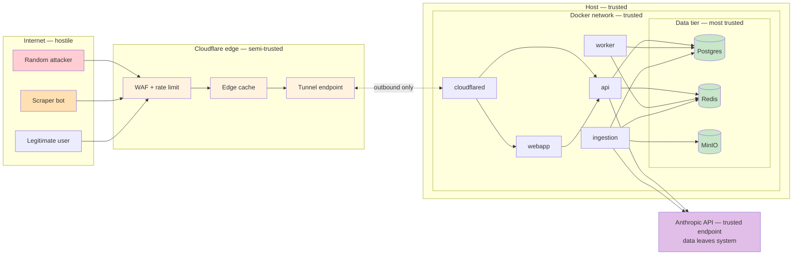

**Trust gradient:**

| Zone | Trust | Notes |
|---|---|---|
| Internet | None — adversarial | Assume every request is hostile |
| Cloudflare edge | Semi — vendor-trusted | WAF + rate-limit applied here |
| Host (LXC / VPS) | High — physically controlled | OS hardened, ssh key only |
| Docker network | High — internal | TLS not required for inter-service |
| Data tier | Highest | Only application services connect; no human shells (audited if needed) |
| Anthropic API | Trusted endpoint | But: data leaves the system; per-message PII review applies |

**Critical property:** the host has **zero inbound public ports**.
All traffic enters via outbound CF Tunnel (cloudflared connects out).

---

## 12. Cache + invalidation flow

**Status: tentative** — locked by ADR-021 (caching strategy) when drafted.
Diagram shows the expected pattern: ISR + edge cache + pub/sub invalidation.

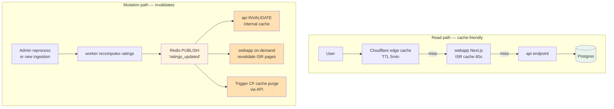

**Cache TTL strategy (proposed):**

| Surface | TTL | Invalidated on |
|---|---|---|
| CF edge cache | 5 min | `ratings_updated` event → API purge |
| Webapp ISR (leaderboard) | 60s | `ratings_updated` → on-demand revalidate |
| Webapp ISR (player profile) | 5 min | `ratings_updated` for that player only |
| API in-memory cache | per-request | n/a (request-scoped only in v1) |

---

## 13. Failure-mode handling

**Status: proposed** — derived from "great from day 1" framing. Final
behavior locked in ADR-016 (quality bar) and per-feature ADRs.

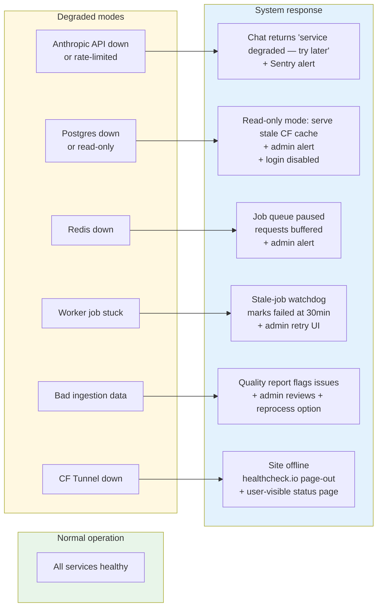

**Principles:**

- **Never silently fail.** Every failure mode produces an admin-visible
  signal (Sentry alert, dashboard widget, status banner).
- **Read paths degrade gracefully.** A Postgres outage means stale reads,
  not a 500 page.
- **Write paths fail loudly.** A user attempting a write during an outage
  gets a clear error, not silent acceptance.
- **Status page** for users — "we're aware, ETA X" beats opaque
  unavailability.

---

## 14. Native app slot (future)

**Status: proposed** — shows how the future native client integrates
without architectural changes. Per `repo-layout.md` §native and ADR-007.

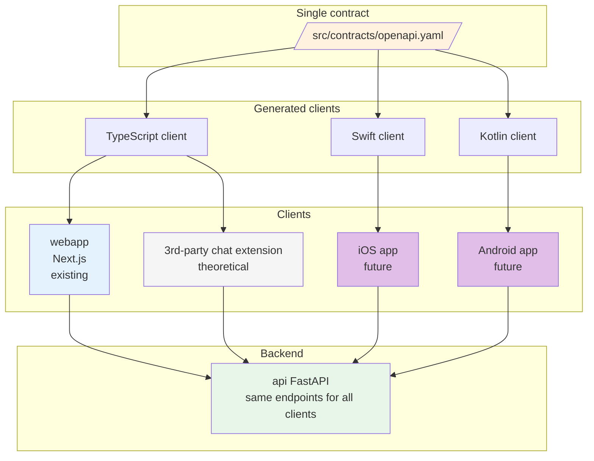

**The integration story:**

- Native app needs **zero new endpoints** — it consumes the same v1
  contract as the webapp.
- Auth works identically because tokens are bearer-style (ADR-009 path).
- Realtime works identically because SSE/WS are HTTP-native (ADR-010).
- The cost of "native-readiness" today is one CI codegen step, paid
  once.

This is the structural payoff of ADR-007's API-as-service decision —
adding a new client is a frontend project, not a backend project.

---

## Maintenance

This file is updated when:

- An ADR is accepted that changes a diagram's confidence level
  (`tentative` → `proposed` → `locked`)
- The schema changes (rare; PLAN.md §6 is the source of truth)
- A new system component is added (worker subtype, new external
  dependency, etc.)

Diagrams should never be more authoritative than the ADR or schema they
derive from. If a diagram and an ADR disagree, the ADR wins and the
diagram is wrong.
